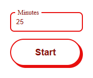

# Pomodoro

[](./README.ru.md)

**Pomodoro** is a browser timer for doing Pomodoro Technique during work. Basically it's an implementation of a kitchen timer.

 \
Application Web UI

## Installation

1. Clone the repository to your computer.

```bash
git clone https://github.com/mrumyantsev/pomodoro.git
```

## Usage

1. Open file `index.html` in your browser by dragging it into the browser window or using the menu **File->Open**.

2. Press the "Start" button to set the timer for the number of minutes specified in the input field (default: 25). Once the timer has elapsed, a chime similar to a kitchen timer will play for 10 seconds.

## System Requirements

- Windows/Linux/macOS
- A browser

## How to work using the Pomodoro Technique?

1. Open the application in your browser and keep it as the first tab. (You'll still need to use the browser while you work.)
2. Start a timer for 25 minutes when you decide to start working.
3. Work focused, without distractions, until the timer rings.
4. When the timer rings, stop your creative work and take a short break (5-10 minutes).
5. Repeat steps 2-4 as long as you need to get work done. Take a longer break (20-30 minutes) after every 4 pomodori are done.

## Features

- You can set an unlimited number of minutes.

## Inspired By

- "[Pomodoro Technique](https://en.wikipedia.org/wiki/Pomodoro_Technique)"

## License

[MIT License](./LICENSE)
